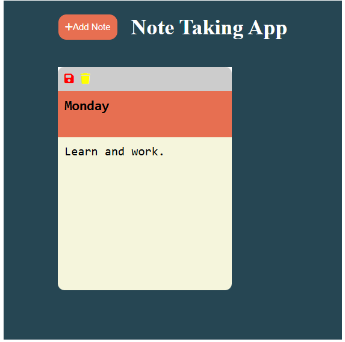

# I have been working on this simple note-taking app using HTML, CSS, and JavaScript.

This project taught me a lot of things, like

How to save data on the local storage

How to get data from the local storage

I learned how to perform CRUD operations on the DOM.

I strengthen my knowledge of how to create new elements on the DOM.

I reviewed the map function, which was helpful to parse the list of titles and contents to JSON so we can stringify them and save them in the local storage.

I will review my previous expense tracker app to implement the same logic so data can be saved on the local storage; after reloading the page, we don't lose the data.